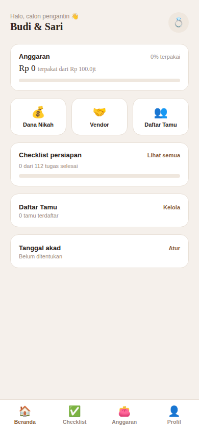
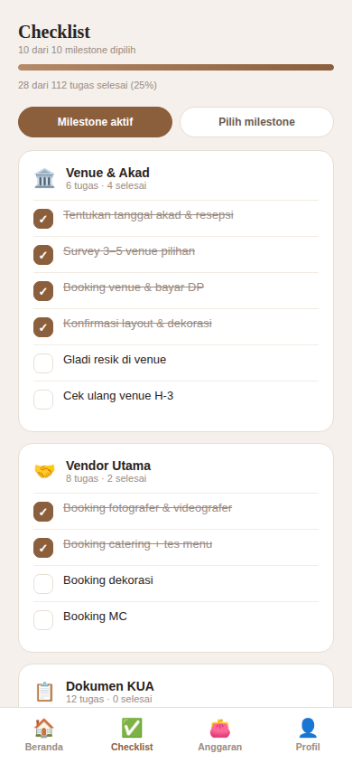
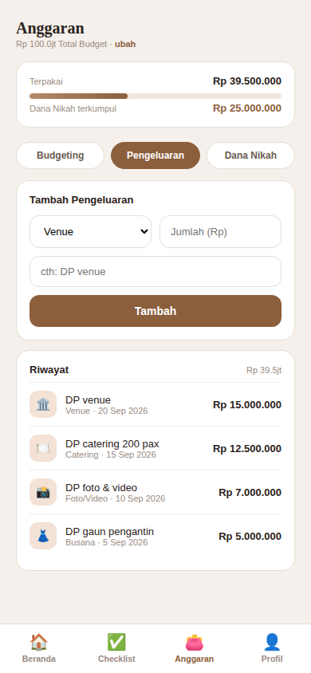
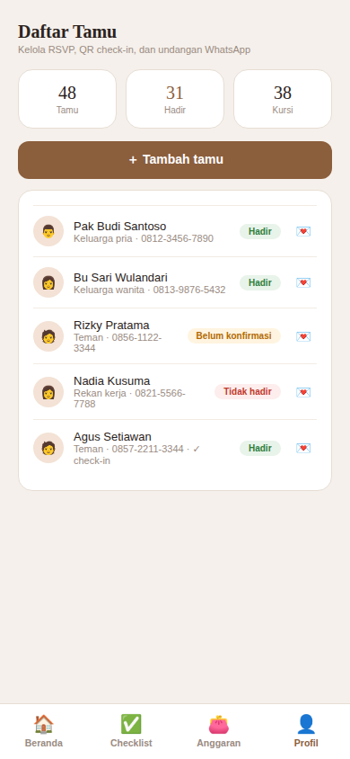
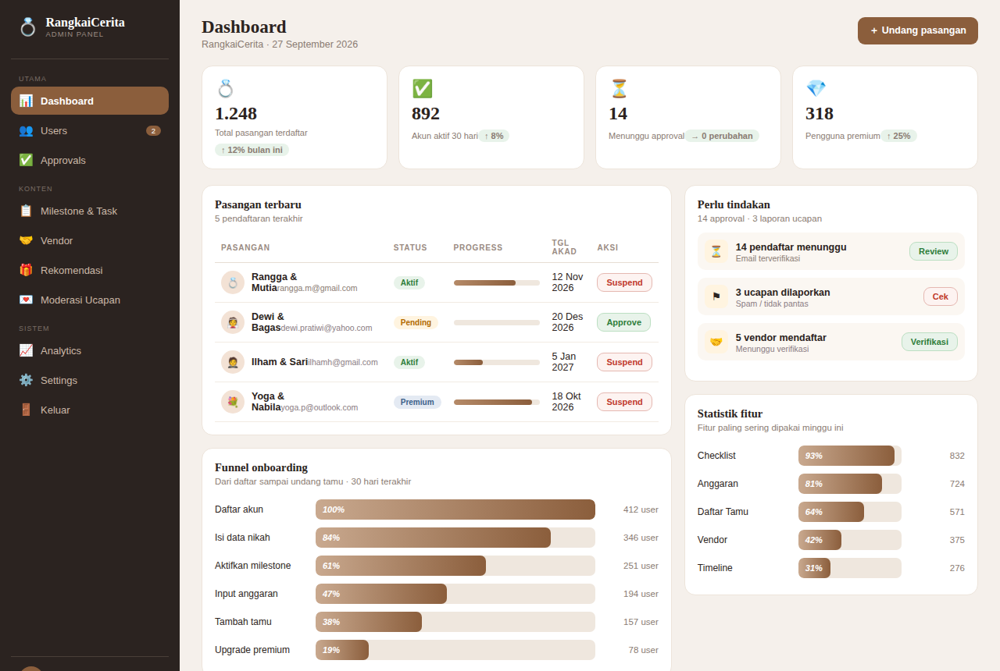
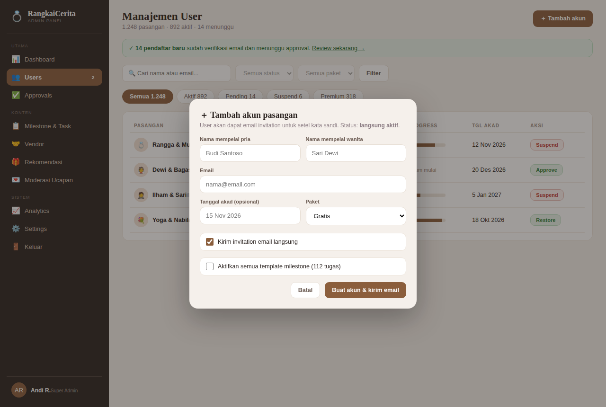

# Mockup / Tampilan

Preview desain aplikasi (render dari file HTML statis di folder ini).

## Aplikasi Pengantin (mobile 390px)

Bottom nav 4 menu: **Beranda / Checklist / Anggaran / Profil**. Tamu & Vendor diakses dari Beranda.

### Beranda

Sapaan nama pasangan, ringkasan anggaran ("Rp 0 terpakai dari Rp 100.0jt"), quick menu (Dana Nikah / Vendor / Daftar Tamu), progress checklist, daftar tamu, tanggal akad.

### Checklist

"10 dari 10 milestone dipilih", tab **Milestone aktif / Pilih milestone**, kartu per-milestone dengan checkbox tugas (contoh: Venue & Akad 6 tugas, Dokumen KUA 12 tugas).

### Anggaran

3 tab: **Budgeting / Pengeluaran / Dana Nikah**. Total budget "Rp 100.0jt · ubah", form tambah pengeluaran (kategori + jumlah + judul), riwayat pengeluaran.

### Daftar Tamu

Statistik (Tamu / Hadir / Kursi), tombol tambah tamu, list dengan status RSVP (Hadir / Belum konfirmasi / Tidak hadir), tombol kirim undangan WhatsApp (💌), badge ✓ check-in.

---

## Admin Panel (desktop)

### Dashboard

- Sidebar: Dashboard, Users, Approvals, Milestone & Task, Vendor, Moderasi Ucapan, Analytics, Settings
- 4 stat card: total pasangan, akun aktif, menunggu approval, premium
- Tabel pasangan terbaru + funnel onboarding + antrian tindakan + statistik fitur

### Manajemen User

- Search + filter status/paket, tab counter (Aktif / Pending / Suspend / Premium)
- Tabel user dengan progress bar, aksi Approve / Suspend / Restore
- Modal **Tambah akun pasangan**: nama pria/wanita, email, tanggal akad, paket, opsi kirim invitation email + aktifkan 112 task template

## Tema desain
- Cream `#F5F0EB` (background), card putih
- Aksen coklat `#8B5E3C`
- Font serif (Georgia) untuk judul & angka
- Mobile-first 390px untuk app pengantin, desktop untuk admin panel
- Bottom nav 4 menu: Beranda / Checklist / Anggaran / Profil
